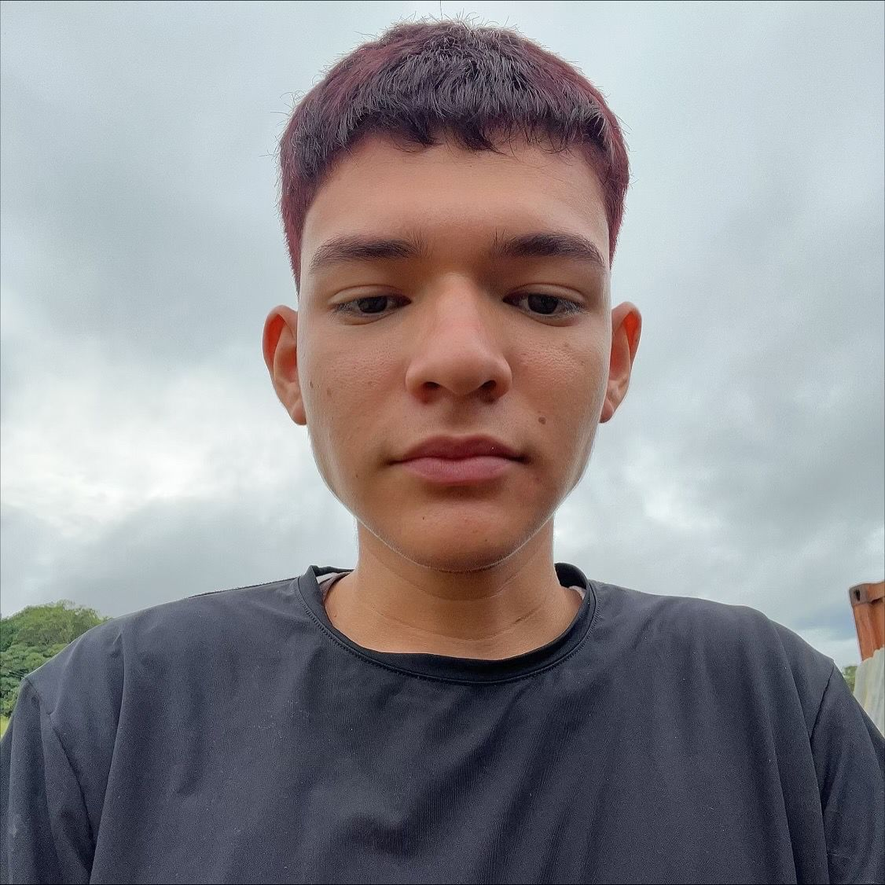

<!DOCTYPE html>
<html lang="es">
<head>
  <meta charset="UTF-8">
  <meta name="viewport" content="width=device-width, initial-scale=1.0">
  <title>Portafolio Profesional - Jhon Alexander Fonseca Murillo</title>
  
</head>
<body>
  <header>
    
JHON ALEXANDER FONSECA MURILLO

    <nav>
      <a href="#inicio">Inicio</a>
      <a href="#acerca">Acerca de mí</a>
      <a href="#estudios">Estudios</a>
      <a href="#proyectos">Proyectos</a>
      <a href="#experiencia">Experiencia</a>
      <a href="#contacto">Contacto</a>
    </nav>
  </header>

  <section id="inicio" class="inicio">
    

      
      

        <h1>Jhon Alexander Fonseca Murillo</h1>
        <h3>Emprendedor | Creador de Contenido | Estudiante de Ingeniería de Sistemas</h3>
        

          Tengo 18 años, soy una persona emprendedora, responsable y apasionada por el crecimiento personal. 
          Estudio Ingeniería de Sistemas en la Universidad Minuto de Dios y un técnico en Emprendimiento 
          y Fomento Empresarial en el SENA. 
          Soy creador de contenido digital, líder en Yanbal y auxiliar administrativo y contable.
        

      

    

  </section>

  <section id="acerca" class="acerca">
    <h2>Acerca de mí</h2>
    

      Me considero una persona comprometida, honesta y dedicada a mis metas. 
      Manejo herramientas de ofimática (Word, Excel, Office), edición de video (CapCut) y 
      plataformas empresariales como WhatsApp Business y Meta Business Suite. 
      Actualmente desarrollo mi liderazgo en Yanbal formando un grupo de mujeres emprendedoras rumbo a la dirección.
    

  </section>

  <section id="estudios" class="estudios">
    <h2>Estudios</h2>
    

      

        <h3>Bachiller Académico</h3>
        
Graduado en noviembre de 2023.

      

      

        <h3>Ingeniería de Sistemas</h3>
        
Universidad Minuto de Dios (Febrero 2024 - Presente).  
        Enfocado en desarrollo de software, análisis de sistemas y gestión tecnológica.

      

      

        <h3>Técnico en Emprendimiento y Fomento Empresarial</h3>
        
SENA (Junio 2025 - Presente).

      

    

  </section>

  <section id="proyectos" class="proyectos">
    <h2>Proyectos</h2>
    

      

        
        

          <h3>Liderazgo Yanbal</h3>
          
Desarrollo de liderazgo, formación de equipo y proyección a ser Director Regional.

        

      

      

        
        

          <h3>Marca de ropa “PRISMA”</h3>
          
Proyecto de moda sostenible y moderna, que busca crear empleo y promover el diseño colombiano.

        

      

      

        
        

          <h3>App para Emprendedores</h3>
          
Aplicación diseñada para gestionar ventas, pagos, envíos y análisis de datos en un solo ecosistema digital.

        

      

    

  </section>

  <section id="experiencia" class="experiencia">
    <h2>Experiencia Laboral</h2>
    

      

        
        

          <h3>Auxiliar de Cocina</h3>
          
2023

        

      

      

        
        

          <h3>Consultor Emprendedor Sénior - Yanbal</h3>
          
Febrero 2024 - Presente

        

      

      

        
        

          <h3>Auxiliar Administrativo y Contable</h3>
          
Noviembre 2025 - Presente

        

      

    

  </section>

  <section id="contacto" class="contacto">
    <h2>Contacto</h2>
    
<strong>Correo:</strong> alex.emprendedor@gmail.com

    
<strong>WhatsApp:</strong> <a href="https://wa.me/573054395826" target="_blank">Enviar mensaje</a>

    

      
      
      
    

  </section>

  <footer>
    
© 2025 Alex - Portafolio Profesional

  </footer>
</body>
</html>
